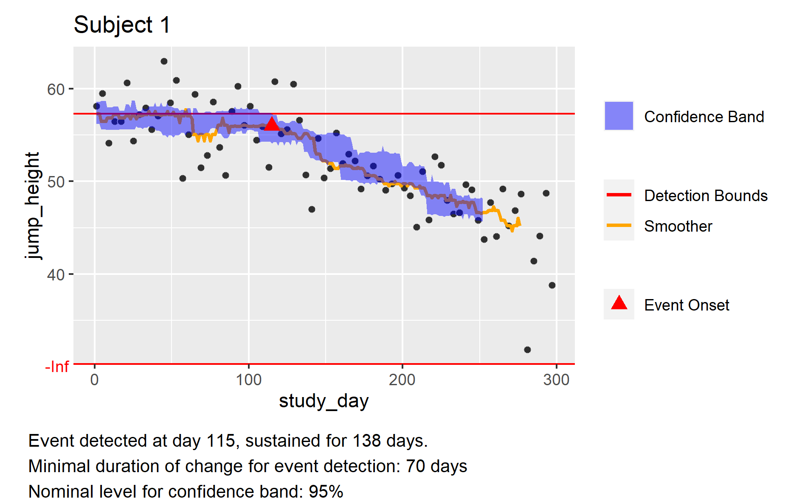
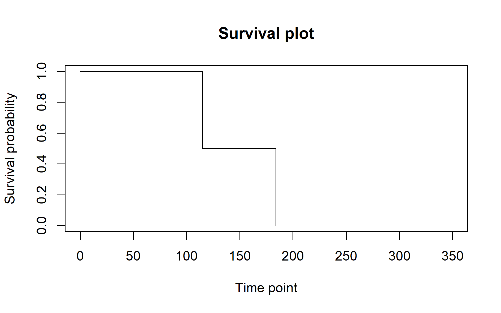

# Summary

`edecob` (Event Detection using Confidence Bounds) is an R package that detects sustained change (which we call “event”) in high-frequency, longitudinally-collected-digital biomarker data. We approximate a subject’s performance using a smoother and detect sustained change by constructing confidence bands for the smoother as described in @buhlmann1998. We define an event as the occasion where confidence bands stay within a prespecified range compared to the baseline for a predefined amount of time. Our approach is robust to noise and the increased variability that can result when the digital assessments are performed outside of a controlled setting [@Roussos_2022]. The parameters of the model are adjustable to enable customization of the methodology to specific user’s cases. 

# Statement of need

A common question occurring in the diagnosis and monitoring of chronic diseases is the detection of sustained worsening on a disease severity measurement that needs to be distinguished from more acute short-term worsening of symptoms. Examples are the monitoring of disability progression in Multiple Sclerosis [@MSBase] or the diagnosis of chronic obstructive pulmonary disease (COPD) [@COPD]. Outcomes of sustained worsening are of particular interest for clinical trials where a new intervention needs to show that it can reduce the risk of long-term disability accumulation. Interventions that can improve symptoms or have the potential to cure the reverse outcome of sustained improvement can be of interest [@improvement].
Digital technologies allow for frequent functional assessments of impairment by patients themselves at home. For measurements at weekly or even daily frequency, traditional definitions of sustained change designed for professionally monitored assessments performed every 3 or 6 months cannot be applied. Digital biomarkers are an active field of research [@biomarkersinMS]. Current software development has mainly focused on using digital biomarker data to distinguishing patients from healthy subjects [@currentsoftware] or on using machine-learning based approach to quantify impairment [@machinelearningapproach].


# Overview

The package can be downloaded from [CRAN](https://CRAN.R-project.org/package=edecob). The user can provide the data to the main function edecob in the long format. The first column specifies the identifier (e.g. a subject identifier in case of a digital biomarker), the second column the time point at which the measure is collected, and the third column the values for this time point. Additionally, the user can supply the detection range in the fourth and fifth columns. Note that this enables detection of either improvement or worsening by choosing appropriate bounds.

```
head(example_data, 3)
#>     subject study_day jump_height detect_lower detect_upper
#> 1 Subject 1         1    55.60844         -Inf     54.41227
#> 2 Subject 1         4    57.77688         -Inf     54.41227
#> 3 Subject 1         7    57.59584         -Inf     54.41227
```

The data frame constitutes the first argument of the main edecob function. We can then specify the following:

* `min_change_dur` specifies the minimal number of time units the confidence bounds need to stay within the detection range to detect an event.

* `detect` specifies how the detection range is determined. When using `above` or `below`, one of the detection bounds will be the median over the data points in the first `bline_period` time units, then multiplied with `detect_factor`. The other detection bound will be `Inf` when choosing `above` or `-Inf` when choosing `below`. `detect` can also be chosen to be `custom`, in which case the detection range will be provided by the user for every subject.

* `resample_method` specifies whether resampling should be done over all residuals `all` or only over a window `window`. If a window is chosen, the window from which residuals should be resampled from can be specified with `resample_win`.

The use of other variables is described in the documentation. If the user wants the confidence range to reflect the local frequency of the data, resampling from all data may be more appropriate. However, if the user wants the confidence range to reflect the local variation of the data rather than the global variation, restricting the resampling over a window may be the right choice. This is especially relevant when analyzing time-dependent data.
```
# We apply the main fuction of the package onto our example_data
example_event <- edecob(example_data, 
			 smoother = "mov_med",
			 resample_method = "window",
			 min_change_dur = 50,
			 conf_band_lvl = 0.95,
			 bt_tot_rep = 50,
			 time_unit = "day",
			 detect = "custom",
			 detect_factor = 1,
                        bline_period = 14,
			 resample_win = c(-5,5))
```
The example_event object contains 3 objects, one corresponding to each subject and a data frame summarizing the event information.
```
names(example_event)
#> [1] "Subject 1"  "Subject 2"  "event_info"
```
We can then choose a patient and plot the confidence bands.

```
plot(example_event$`Subject 1`)
```
{width=80%}

The event information is summarized and accessible in a table called `event_info`. It contains the information about whether an event was detected, the time point of onset of the event, how long the change is sustained, and whether the event is sustained until the end of available observations for the subject.

```
example_event$event_info
#>           event_detected event_onset event_duration event_stop
#> Subject 1           TRUE         169             87       TRUE
#> Subject 2           TRUE         205             51       TRUE
#> Subject 3          FALSE         306             38      FALSE
```

Using this table, we can generate a survival plot using the survival package (citation needed).

```
library("survival")
plot(survfit(Surv(time = event_onset, event = event_detected) ~ 1,
             data = example_event$event_info),
     conf.int = FALSE, xlim = c(0,350), ylim = c(0,1), mark.time = TRUE,
     xlab = "Study Day", ylab = "Survival Probability", main = "Survival plot")
```

{width=80%}

In case of a large number of subjects, the main function edecob is parallelizable by separately calling the function for every subject. Note that if the data frame given to edecob contains only one subject, for example only the data from Subject 1 in our example, the output will be a list equal to `` example_event$`Subject 1` `` instead of the format specified above.

# References
